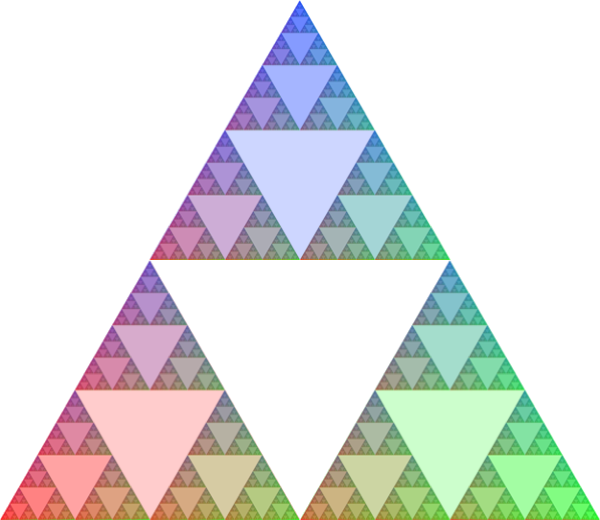
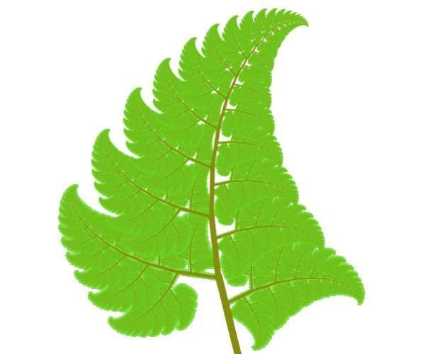
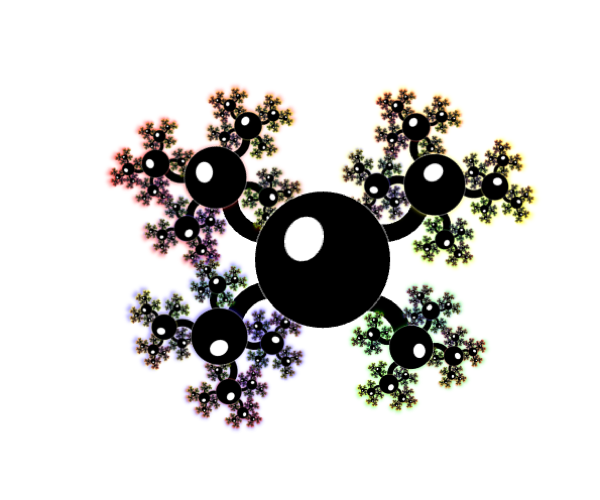
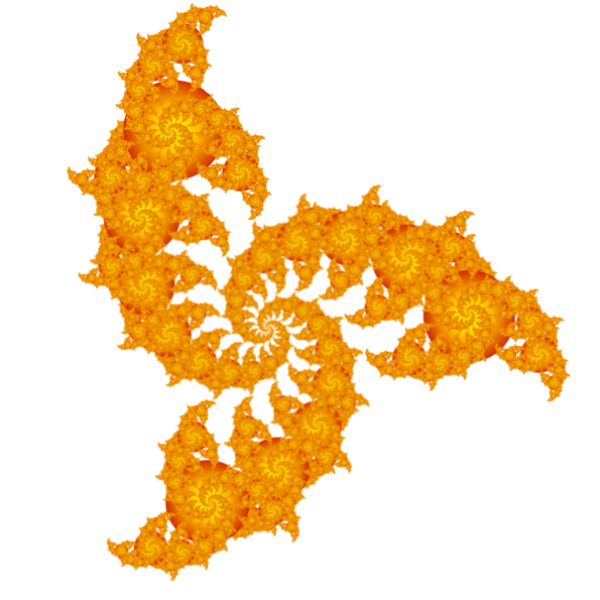

# PowerPoint Fractals

Fractal art made using only Microsoft PowerPoint.
Using the Slide Zoom feature you can generate a wide range of dofferent fractal images.

## See them

From regular mathematical shapes, to natural objects, to weird abstract images:

View all the images [here](//emlyn.github.io/PowerPointFractals).

## How to make them
