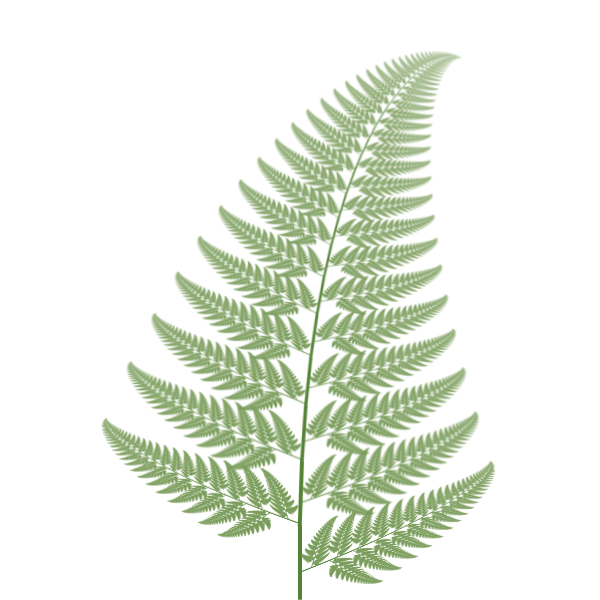

# PowerPoint Fractals

Fractal art made using only Microsoft PowerPoint.
Using the Slide Zoom feature you can generate a wide range of different fractal images.

## See them

From regular mathematical shapes, to natural objects, to weird abstract images and even 3D shapes:

These are just a few examples, you can view all of the images [here](//emlyn.github.io/PowerPointFractals).

## Introduction

All of these fractals are generated using only Microsoft PowerPoint.

The main feature needed for this is called Slide Zoom.
This allows an image of a slide to be embedded in the slide itself,
which updates automatically when the slide changes.

This causes a loop of redrawing:
- You insert a Slide Zoom pointing to the current slide.
- PowerPoint draws a view of the whole slide into the Slide Zoom.
- It notices that the content of the slide has changed.
- So it draws the updated view of the whole slide into the Slide Zoom again.
- This continues until it reaches a fixed point, where updating the Slide Zoom with the
contents of the whole slide no longer changes what the slide looks like.
- By adding one or two simple shapes, and adjusting the number, size, position and rotation of the Slide Zooms,
you can generate all sorts of different fractal images.

## How to make them

- Start by opening a new PowerPoint presentation.
You need to use the desktop version of the app (it doesn't work with the online version).
- Set the page size (File > Page Setup...). It's easier to adjust the size and position of things accurately
if the page width and height are round numbers and the aspect ratio is a simple fraction, e.g. 1:1 (square) or 3:4.
- Delete the default text boxes on the slide
- Insert an object on the slide, e.g. Insert > Shape > Oval, then drag an oval on the slide.
It doesn't matter for now what shape it is, but it's easier to see and manipulate the Slide Zoom later if there is something to see on the slide.
- Insert a Slide Zoom pointing to the current slide (Insert > Zoom > Slide Zoom, Select the current (or only) slide, and click Insert).
- You can also do this from the Insert ribbon (tool bar): click the Zoom button and select Slide Zoom: 
 
then insert the current slide as above.
- Right-click on the Slide Zoom to bring up the context menu. Select Zoom Background.
This gives the Slide Zoom a transparent background
- Adjust the size, position, and rotation on the Slide Zoom (the default size is quite small, so you might want to make it bigger)
- Add another Slide Zoom. Instead of following the previous steps, this time you can copy the existing Slide Zoom and paste it back into the slide.

## References

### The videos that inspired this:

- [Recursive PowerPoint Presentations [Gone Fractal!]](https://www.youtube.com/watch?v=b-Fa6HtvGtQ), Matt Parker and Steve Mould, 17 May 2019
- [An easier way to make fractals in PowerPoint](https://www.youtube.com/watch?v=O8l_awjgoMI), Tom Wildenhain, 24 May 2019

### More information:

- [Fractals are typically not self-similar](https://www.youtube.com/watch?v=gB9n2gHsHN4), 3Blue1Brown
- [Measuring coastlines](https://youtu.be/7dcDuVyzb8Y), Numberphile
- [The Fractal Menger Sponge and Pi](https://www.youtube.com/watch?v=8pj8_zjelDo), Stand-up Maths
- [Dragon Curve](https://www.youtube.com/watch?v=wCyC-K_PnRY), Numberphile
- [Digital Plants (L-Systems)](https://www.youtube.com/watch?v=puwhf-404Xc), Computerphile
- [Analog Fractals with 1930's Technology](https://www.youtube.com/watch?v=Pv26QAOcb6Q), CodeParade
