# Fractal Art

I've tried to separate the pictures into a few different categories.

## Triangles

[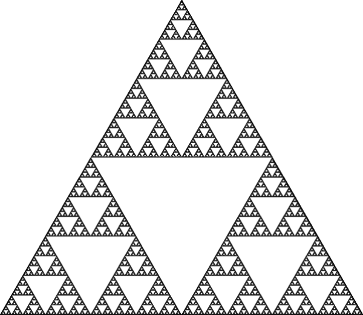](//raw.githubusercontent.com/emlyn/PowerPointFractals/main/pictures/01-triangles/1-sierpinski_2400.png)

[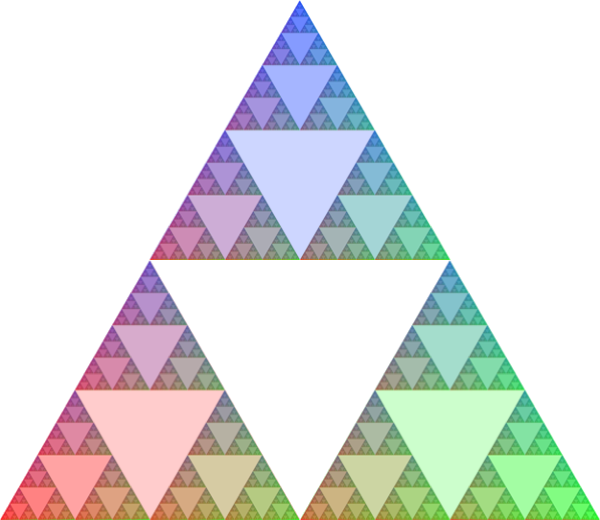](//raw.githubusercontent.com/emlyn/PowerPointFractals/main/pictures/01-triangles/4-rgb_2400.png)
[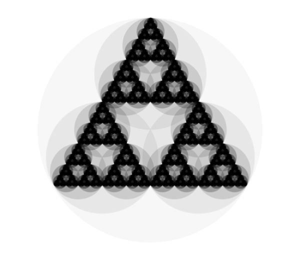](//raw.githubusercontent.com/emlyn/PowerPointFractals/main/pictures/01-triangles/5-circles_2400.png)
[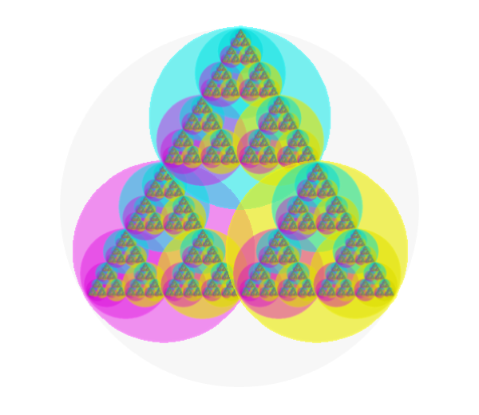](//raw.githubusercontent.com/emlyn/PowerPointFractals/main/pictures/01-triangles/6-cmy_2400.png)

## Squares

[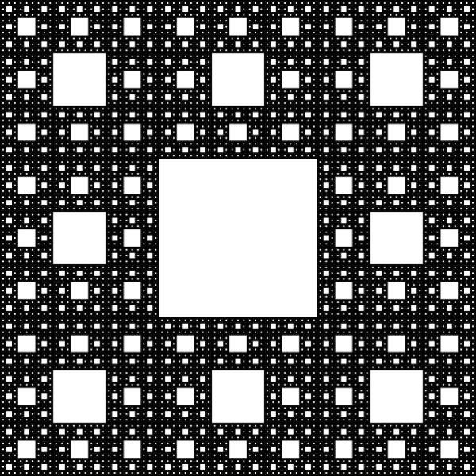](//raw.githubusercontent.com/emlyn/PowerPointFractals/main/pictures/02-squares/1-sierpinski_2400.png)
[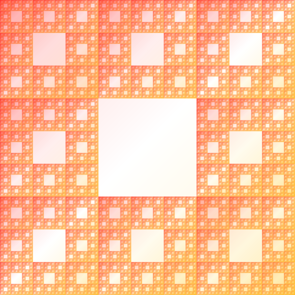](//raw.githubusercontent.com/emlyn/PowerPointFractals/main/pictures/02-squares/2-gradient_2400.png)
[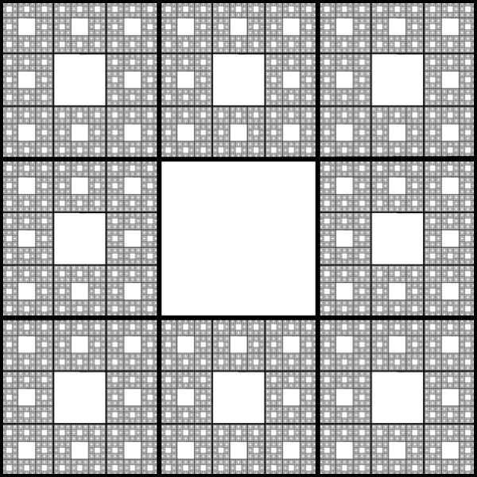](//raw.githubusercontent.com/emlyn/PowerPointFractals/main/pictures/02-squares/3-outline_2400.png)
[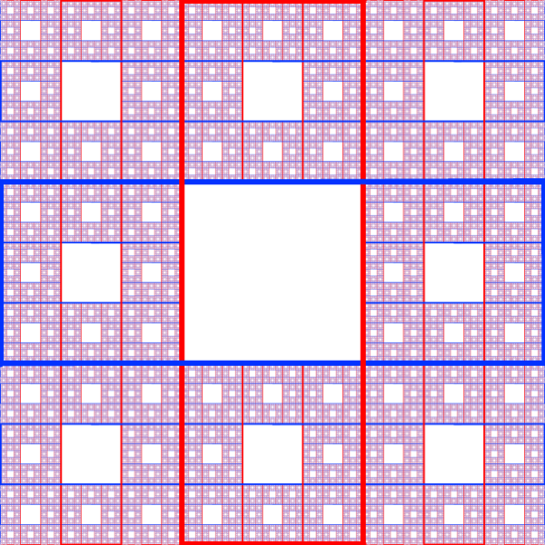](//raw.githubusercontent.com/emlyn/PowerPointFractals/main/pictures/02-squares/4-coloured-outline_2400.png)
[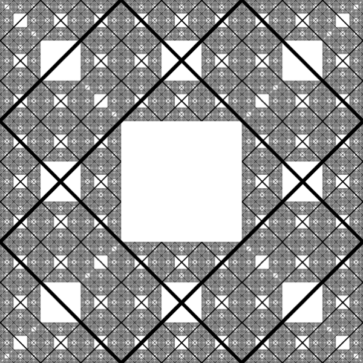](//raw.githubusercontent.com/emlyn/PowerPointFractals/main/pictures/02-squares/5-diagonals_2400.png)

[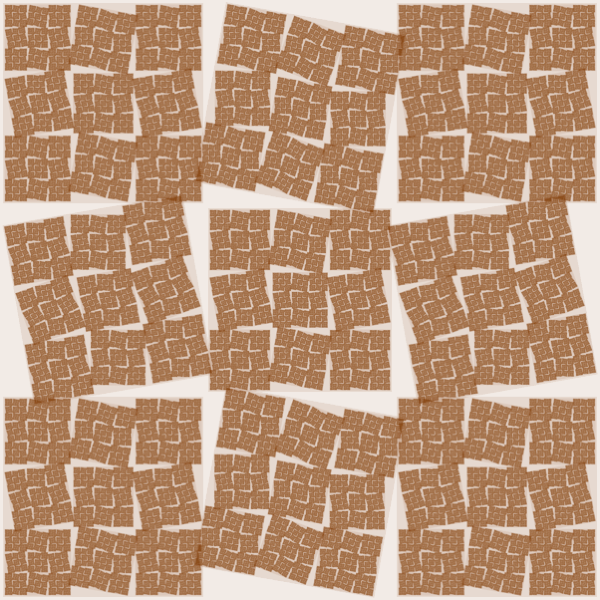](//raw.githubusercontent.com/emlyn/PowerPointFractals/main/pictures/02-squares/7-distorted_2400.png)

## Pentagons

[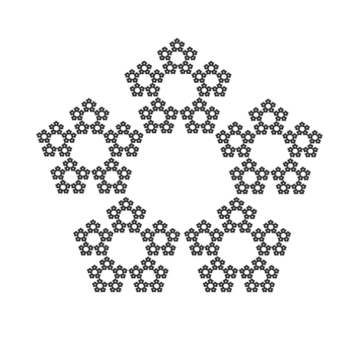](//raw.githubusercontent.com/emlyn/PowerPointFractals/main/pictures/03-pentagons/1-sierpinski_2400.png)

[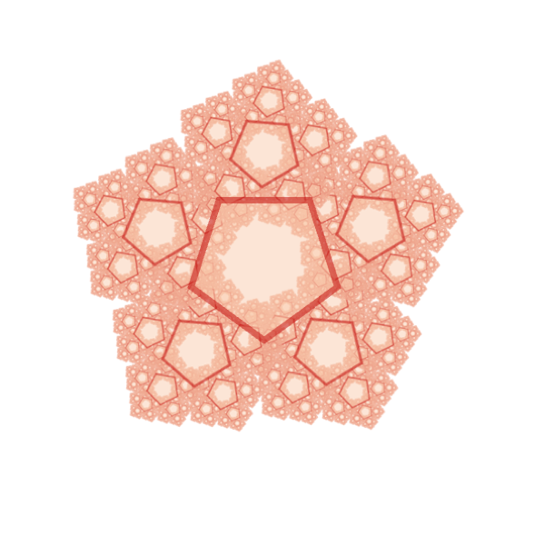](//raw.githubusercontent.com/emlyn/PowerPointFractals/main/pictures/03-pentagons/3-twist_2400.png)

## Hexagons

[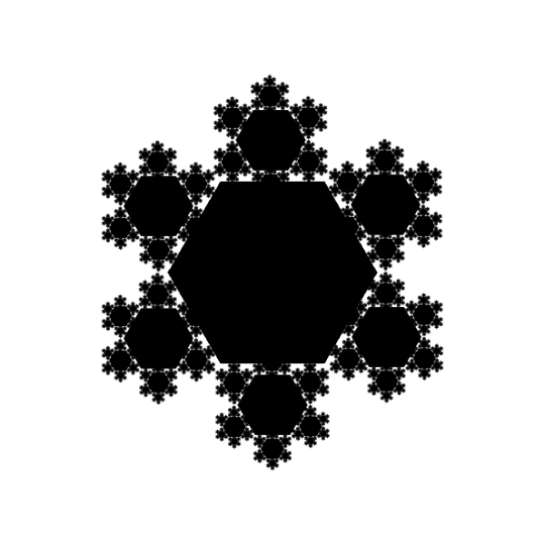](//raw.githubusercontent.com/emlyn/PowerPointFractals/main/pictures/04-hexagons/2-exploding_2400.png)
[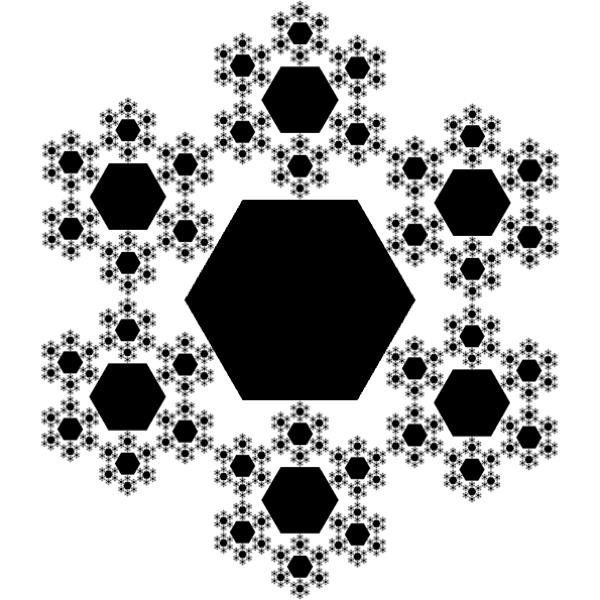](//raw.githubusercontent.com/emlyn/PowerPointFractals/main/pictures/04-hexagons/3-exploded_2400.png)

[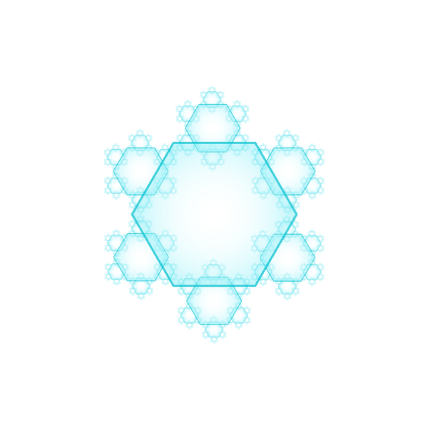](//raw.githubusercontent.com/emlyn/PowerPointFractals/main/pictures/04-hexagons/6-cell_2400.png)

## Linear

[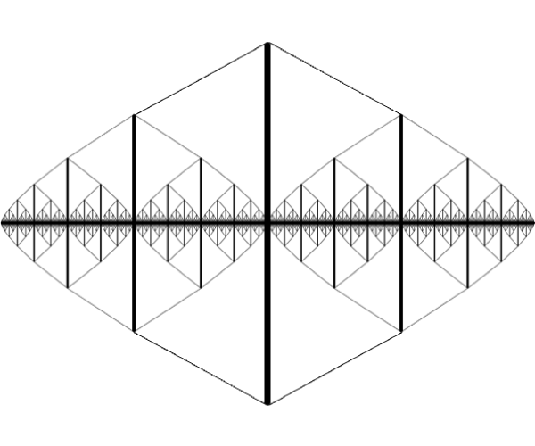](//raw.githubusercontent.com/emlyn/PowerPointFractals/main/pictures/05-linear/1-powerlines_2400.png)

[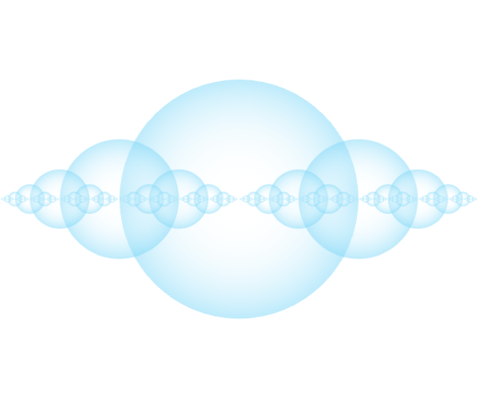](//raw.githubusercontent.com/emlyn/PowerPointFractals/main/pictures/05-linear/3-bubbles_2400.png)
[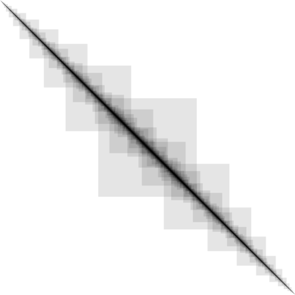](//raw.githubusercontent.com/emlyn/PowerPointFractals/main/pictures/05-linear/4-shard_2400.png)
[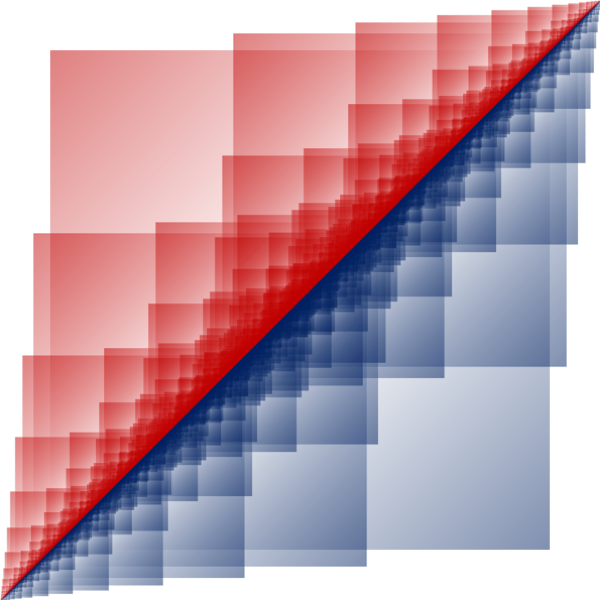](//raw.githubusercontent.com/emlyn/PowerPointFractals/main/pictures/linear/5-jagged_2400.png)
[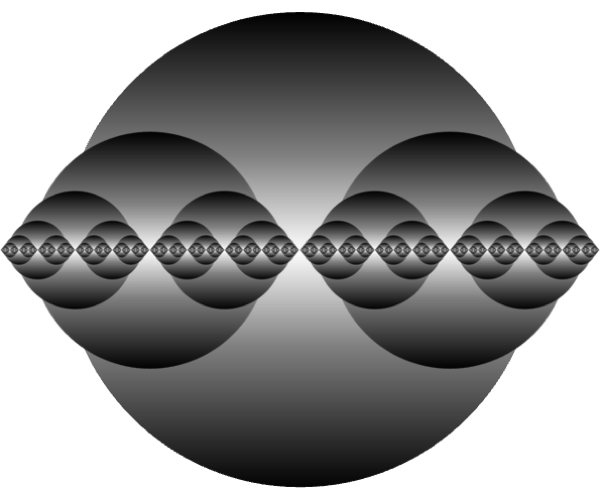](//raw.githubusercontent.com/emlyn/PowerPointFractals/main/pictures/05-linear/6-metal_2400.png)
[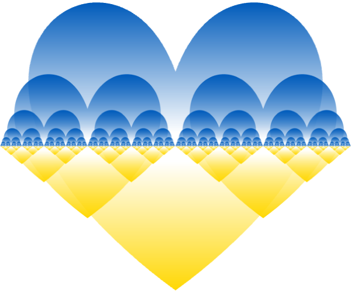](//raw.githubusercontent.com/emlyn/PowerPointFractals/main/pictures/05-linear/7-ukraine_2400.png)

## Mathematical Curves

[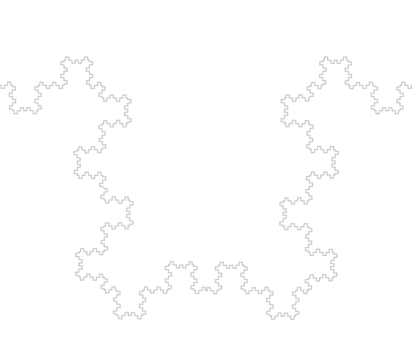](//raw.githubusercontent.com/emlyn/PowerPointFractals/main/pictures/06-curves/2-square_2400.png)
[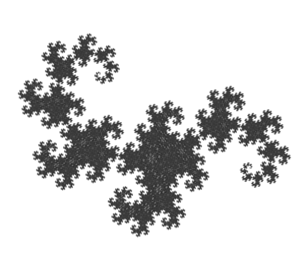](//raw.githubusercontent.com/emlyn/PowerPointFractals/main/pictures/06-curves/3-dragon_2400.png)
[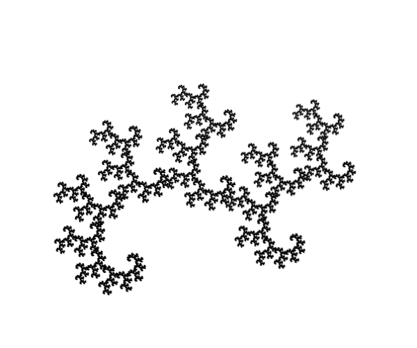](//raw.githubusercontent.com/emlyn/PowerPointFractals/main/pictures/06-curves/4-golden_2400.png)
[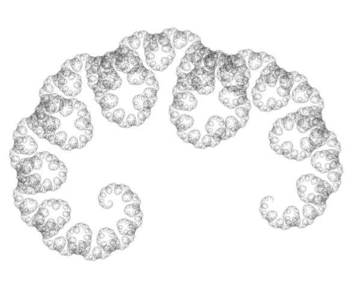](//raw.githubusercontent.com/emlyn/PowerPointFractals/main/pictures/06-curves/5-pythagoras_2400.png)

## Plants

[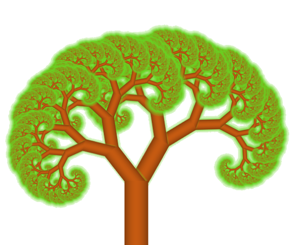](//raw.githubusercontent.com/emlyn/PowerPointFractals/main/pictures/07-plants/2-tree_2400.png)

[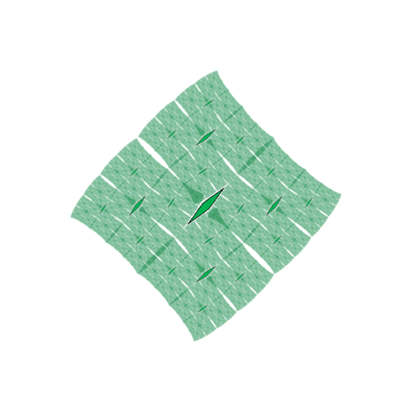](//raw.githubusercontent.com/emlyn/PowerPointFractals/main/pictures/07-plants/6-bamboo_2400.png)
[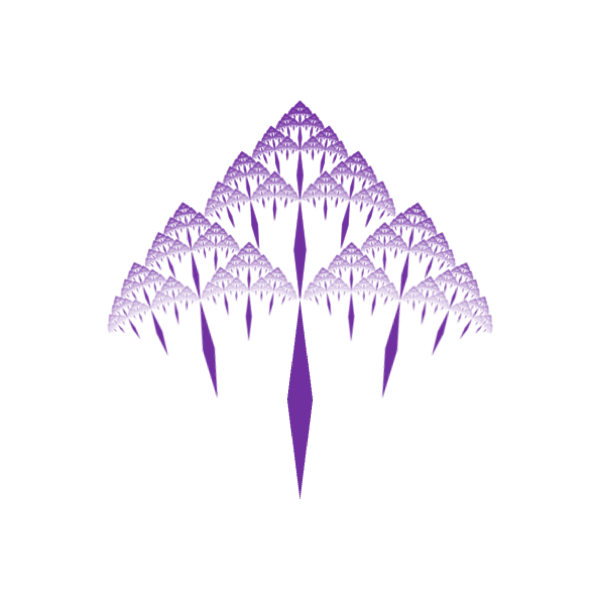](//raw.githubusercontent.com/emlyn/PowerPointFractals/main/pictures/07-plants/7-mushrooms1_2400.png)

## Nature (other than plants)

[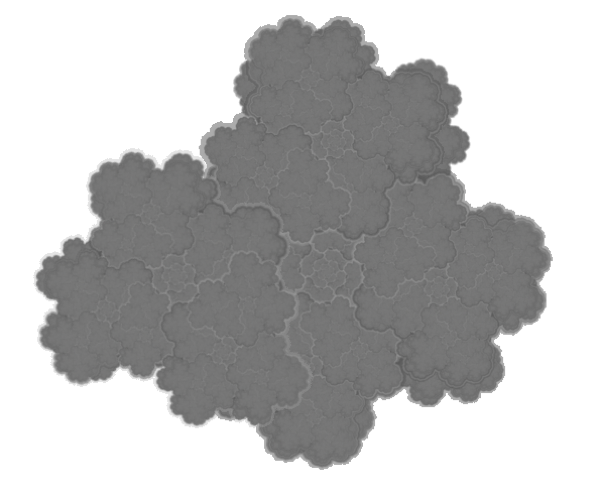](//raw.githubusercontent.com/emlyn/PowerPointFractals/main/pictures/08-nature/1-cloud_2400.png)
[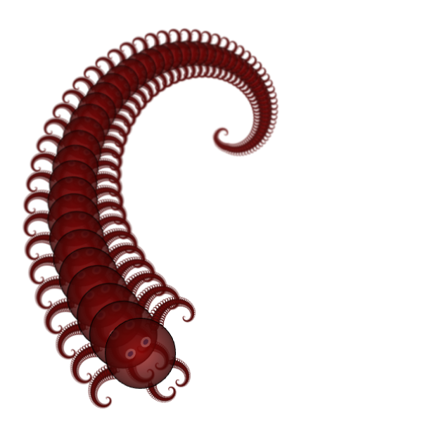](//raw.githubusercontent.com/emlyn/PowerPointFractals/main/pictures/08-nature/2-centipede_2400.png)

## Abstract

[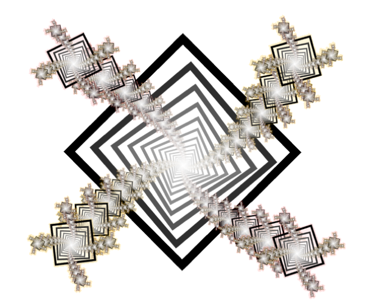](//raw.githubusercontent.com/emlyn/PowerPointFractals/main/pictures/09-abstract/1-abstract1_2400.png)
[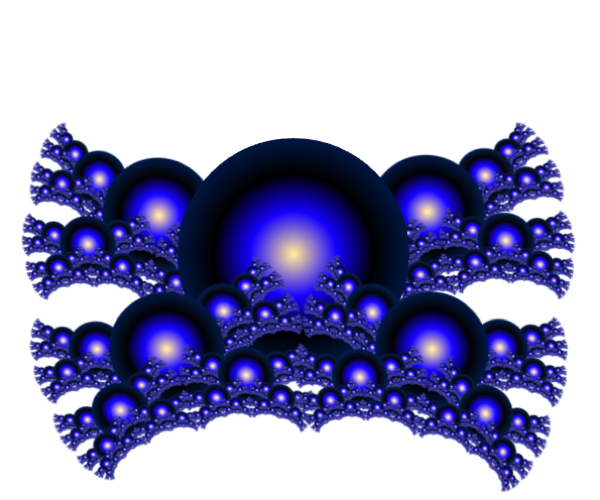](//raw.githubusercontent.com/emlyn/PowerPointFractals/main/pictures/09-abstract/2-abstract2_2400.png)
[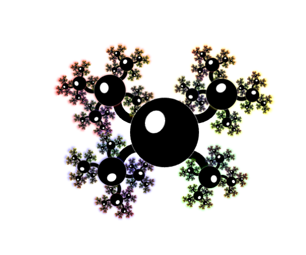](//raw.githubusercontent.com/emlyn/PowerPointFractals/main/pictures/09-abstract/3-abstract3_2400.png)
[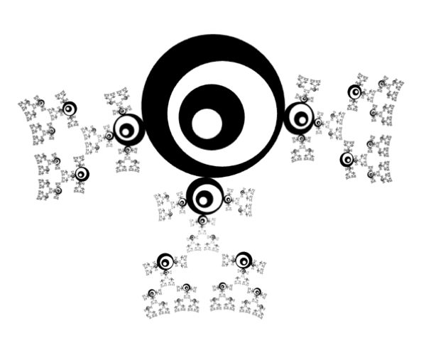](//raw.githubusercontent.com/emlyn/PowerPointFractals/main/pictures/09-abstract/4-abstract4_2400.png)
[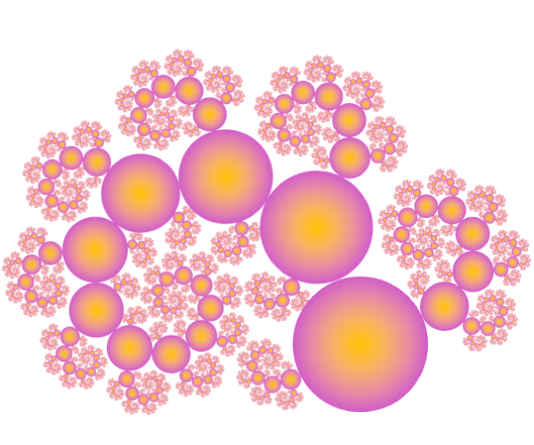](//raw.githubusercontent.com/emlyn/PowerPointFractals/main/pictures/09-abstract/5-abstract5_2400.png)
[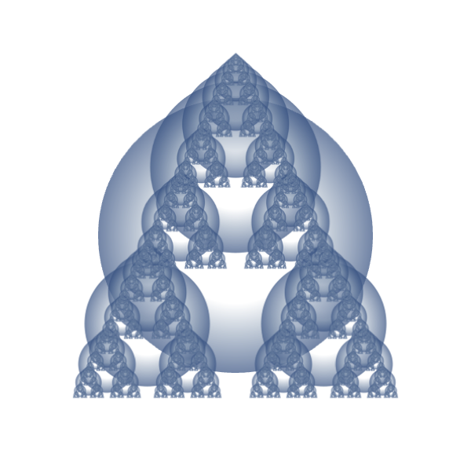](//raw.githubusercontent.com/emlyn/PowerPointFractals/main/pictures/09-abstract/6-abstract6_2400.png)

## Spirals

[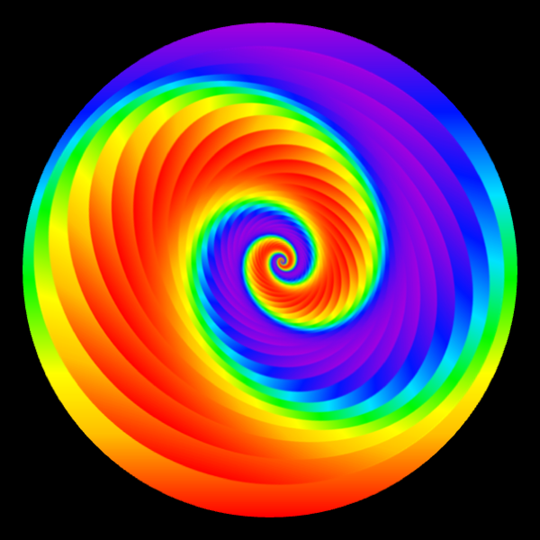](//raw.githubusercontent.com/emlyn/PowerPointFractals/main/pictures/10-spiral/1-rainbow_2400.png)
[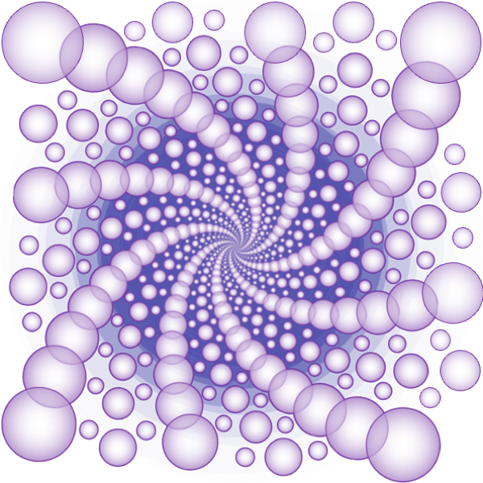](//raw.githubusercontent.com/emlyn/PowerPointFractals/main/pictures/10-spiral/2-vortex_2400.png)
[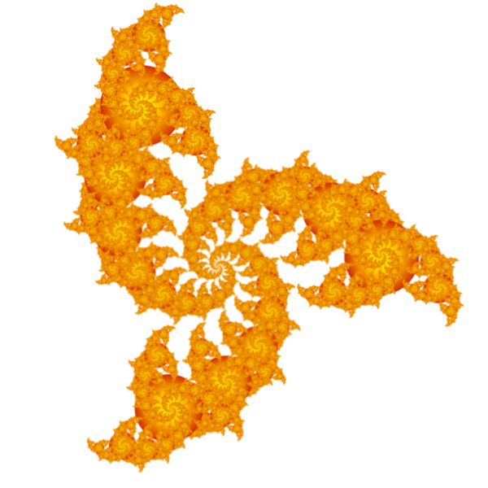](//raw.githubusercontent.com/emlyn/PowerPointFractals/main/pictures/10-spiral/3-fire_2400.png)
